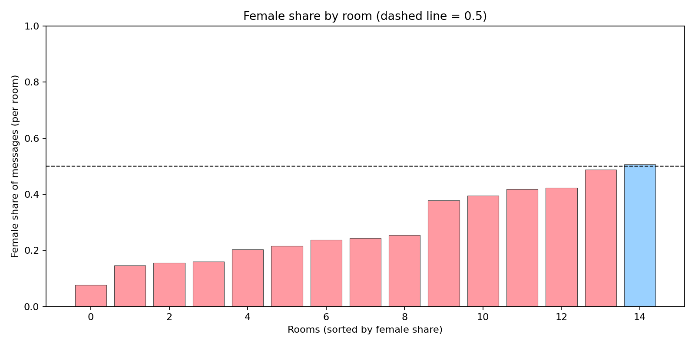
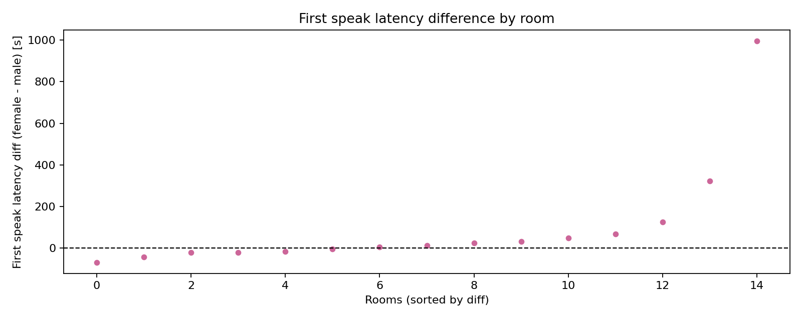

# Gender Analysis

We compare female (Lily, 张三) vs male across participant-room rows.

- msg_count: female_mean=25.400 male_mean=28.300 n_f=15 n_m=30 p=0.4128 cliff_delta=-0.153
- mean_len: female_mean=16.929 male_mean=17.077 n_f=15 n_m=30 p=0.9137 cliff_delta=-0.022
- q_rate: female_mean=0.049 male_mean=0.016 n_f=15 n_m=30 p=0.2064 cliff_delta=0.189
- laugh_rate: female_mean=0.076 male_mean=0.049 n_f=15 n_m=30 p=0.3281 cliff_delta=0.173
- room_share: female_mean=0.287 male_mean=0.356 n_f=15 n_m=30 p=0.1626 cliff_delta=-0.260

## Engagement metrics
- reply_60_per_msg: female_mean=2.818 male_mean=2.626 n_f=15 n_m=30 p=0.7180 cliff_delta=0.069
- reply_120_per_msg: female_mean=5.331 male_mean=5.007 n_f=15 n_m=30 p=0.7001 cliff_delta=0.073
- frl_median_s: female_mean=13.667 male_mean=19.283 n_f=15 n_m=30 p=0.1482 cliff_delta=-0.269
- mention_in_replies_rate: female_mean=0.000 male_mean=0.000 n_f=15 n_m=30 p=1.0000 cliff_delta=0.000

## Within-room Wilcoxon (female - male)
- q_diff: mean_diff=0.0307 n_rooms=15 p=0.1302
- laugh_diff: mean_diff=0.0248 n_rooms=15 p=0.1941
- len_diff: mean_diff=16.8776 n_rooms=15 p=0.0000

## Female disadvantage probes
- female_share vs 0.5: n_rooms=15 Wilcoxon_stat=1.0 p=6.103515625e-05
  -> Significant: females' share < 0.5 across rooms.
- first_speak latency (female - male): n_rooms=15 Wilcoxon_stat=84.0 p=0.09381103515625
- first speaker female proportion: k=6/15 p=0.30361938476562494

## Figures (female disadvantage)

## Adjusted for 2M:1F design
- female_share vs expected (≈1/3): Wilcoxon p=0.06768798828125
- per-capita (female − male) msgs: Wilcoxon p=0.2388224671252932
- per-capita log ratio: Wilcoxon p=0.053497314453125

## Power-enhanced tests (sign & permutation)
- diff_share: n_nonzero=15 negatives=9/15 mean=-0.0463 sign_p=0.3036 perm_p=0.1030
- log_ratio_percap: n_nonzero=15 negatives=9/15 mean=-0.3199 sign_p=0.3036 perm_p=0.0572

## No-reply disadvantage (120s window)
- female − male no-reply rate (per room): Wilcoxon p=0.4451904296875

## Quick replies and question-answered
- has_reply_30_rate: n_rooms=15 mean_diff=0.0920 p=0.885345458984375
- has_reply_60_rate: n_rooms=15 mean_diff=0.0396 p=0.755645751953125
- q_answered_rate: n_rooms=15 mean_diff=0.0344 p=0.9192852688164583
- frl_unlim_median: n_rooms=15 mean_diff=-12.1000 p=0.9793365705437498

## Robust tests after trimming extremes
- no_trim: diff_share n=15 mean=-0.0463 p=0.0677; log_ratio n=15 mean=-0.3199 p=0.0535
- trim1: diff_share n=13 mean=-0.0402 p=0.0955; log_ratio n=13 mean=-0.2591 p=0.0839

## Per-capita characters (female vs male)
- diff_pc_chars (female − male): Wilcoxon p=0.138427734375
- log_ratio_pc_chars: Wilcoxon p=0.06768798828125

## Combined evidence (per-room binomial & t-test)
- female_share vs expected (~1/3): Fisher p=1.1038535138378956e-08, Stouffer p=0.05513524551769471
- first speaker female vs 1/3: k=6/15 binom p=0.7969610507615666
- per-capita log ratio t-test (mean<0): p=0.05535985466787953
